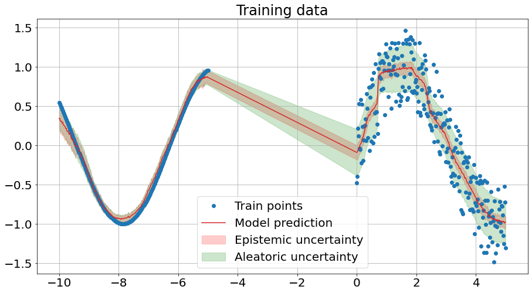

# UQ_NNs

### Background
We use Alex Kendall and Yarin Gal's brilliant paper "[What Uncertainties Do We Need in Bayesian Deep Learning for Computer Vision]([url](https://proceedings.neurips.cc/paper/2017/hash/2650d6089a6d640c5e85b2b88265dc2b-Abstract.html))" to simultaneously estimate data and model uncertainties of a simple regression MLP model.

* To quantify model uncertainty, we introduce dropout at each layer of the MLP, which we _retain in testing_ unlike conventional use of Dropout for network regularization, where dropout is only implemented in training. 
* To quantify data uncertainty, we modify the network to output the mean and log variance (s_i)and train over a loss function like so:

$$L = \frac{1}{B} \displaystyle \sum_{n=i} ^{B}0.5*exp(-s_i)||y_i-\hat{y_i}||^2 + 0.5s_i$$

* During inference, we run T forward passes over the trained network (which still has dropout) and use the mean and std of the predictions to obtain the model (epistemic) uncertainty and the mean variance as predicted by the network for the data (aleatoric) uncertainty. Hence, the total variance at each predicted point is given by:

$$ Var(y) \approx \frac{1}{T} \sum_{t}^{T}\hat{y_t}^2 - (\frac{1}{T} \sum_{t}^{T} \hat{y_t})^2 + \frac{1}{T} \sum_{t}^{T} \hat{\sigma_t}^2 $$

The first two terms together represent the variance over the model predictions from Dropout and the third term represents the variance learnt by the network to best (most efficiently) describe the noise in the data. 

### Aleatoric (data) and Epistemic (model) uncertainty on training data

### Aleatoric (data) and Epistemic (model) uncertainty on test data

Regions of noise-free data, e.g. -10 to -5 have low uncertainty, regions with no data, e.g. -5 to 0 have high uncertainties and regions with noisy data e.g. 0-5 have low model uncertainty but high data uncertainty. As we go farther out to regions not fit at all, the model uncertainty continues to grow. 
